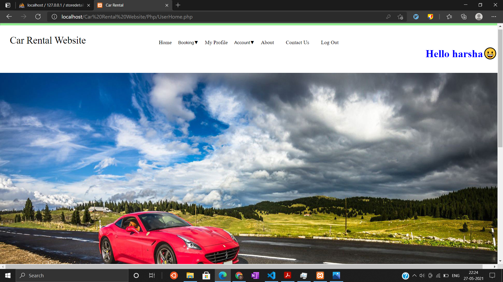
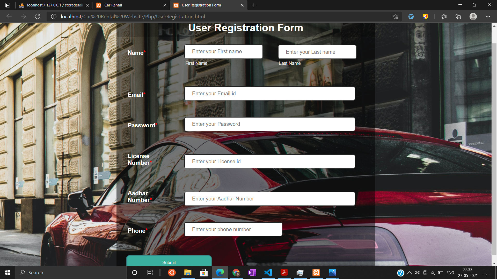

# Car Rental Management System

> This  Website acts as intermediate between car owner and customer 

#### How to use this website /Features:
* Customer/Owner should  create account
* Login with proper credentials
* Customer/Owner can view their profile
* Customer/Owner can update their password/delete account
* Customer/Owner can give their feedback/queries
* Owner can Add car/Cancel car/Booking history
* Customer can Book car/Cancel car/Booking history

#### Used Languages are 
> * Html 
> * Css
> * Php
> * Mysql
> * JavaScript

#### Used tools are 
> * Xampp App           - For Detabase
> * Visual Studio Code  - Editor

#### How to run this  website on your local system:

* Install Xampp app and start Apache,Mysql Servers
* Set up database in Xampp -
    > Go to PhpMyAdmin 
    > Create a database
    > Go to import
    > Select storedetails.sql file present in MY Sql directory
    > Press enter So that all the data will be updated
* Now open your browser 
* Type localhost/{Your path to this directory}
* And then enjoy the site!!

#### Sample Frontend :

##### Login Page

##### Home Page

##### Registration page
